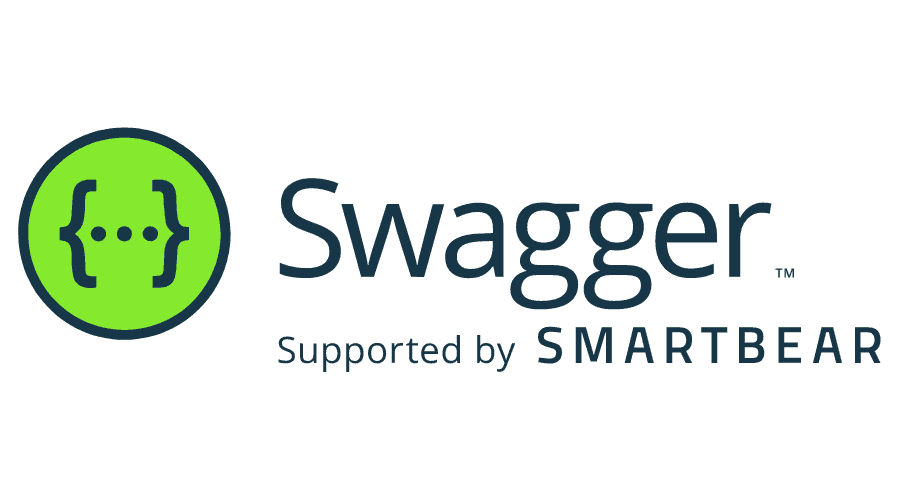
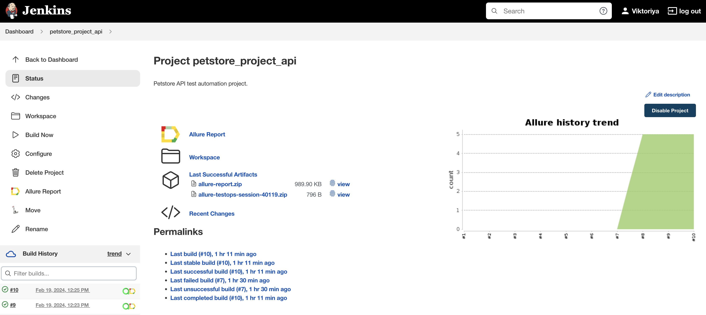
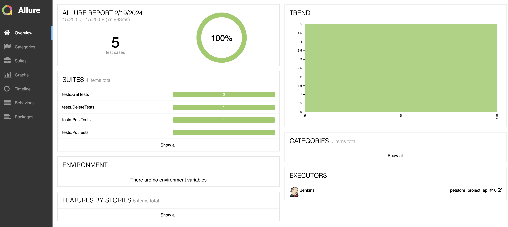
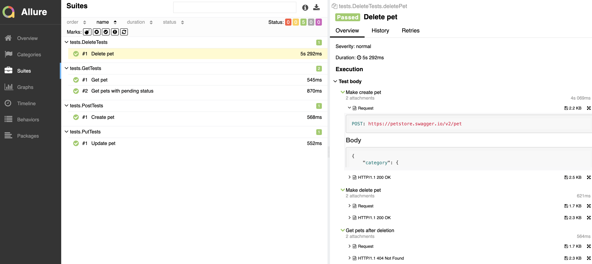
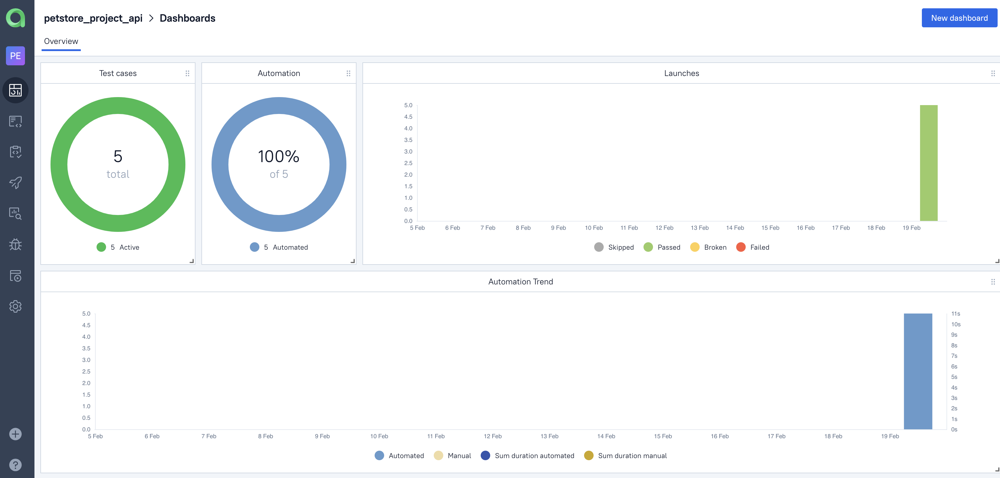
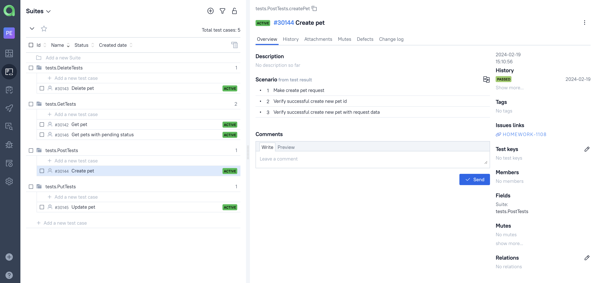
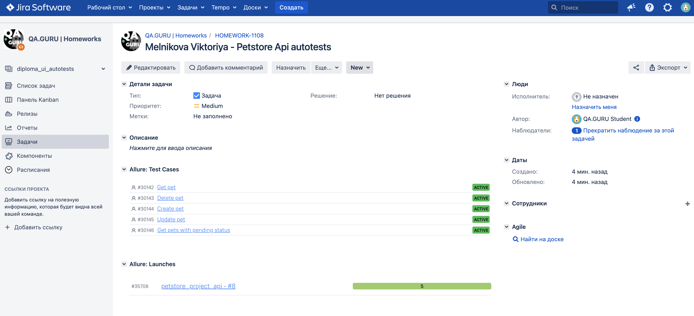
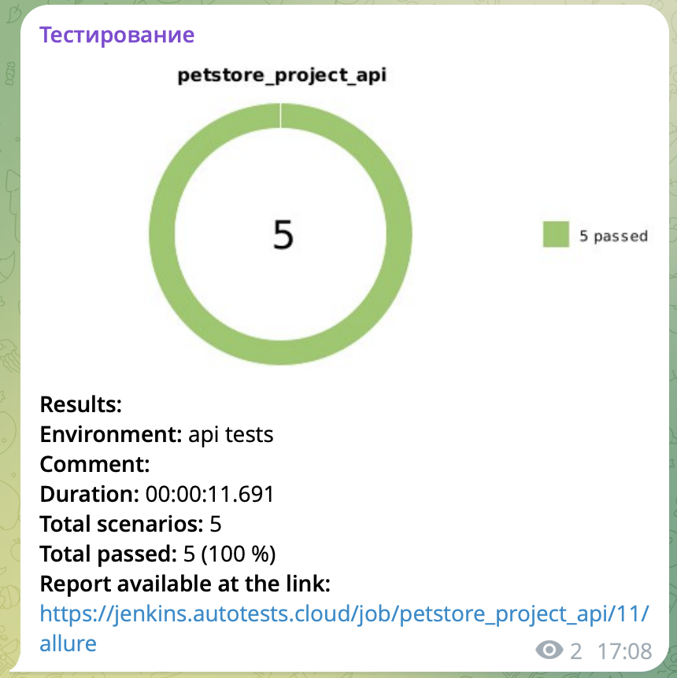

<h1 align="center"> Demo project to automate API testing for service <a href="https://petstore.swagger.io/">Petstore swagger</h1>
<div align="center">
  <a href="https://petstore.swagger.io/"></a>
</div>

> Swagger is a toolkit for API developers from SmartBear Software and the former specification on which the OpenAPI specification is based.

# :open_file_folder: <a name="TableOfContents">Table of contents</a>

* <a href="#Description">Description</a>
* <a href="#Technology">Tools and technologies</a>
* <a href="#HowToRun">How to run</a>
* <a href="#AllureReport">Test results report in Allure Report</a>
* <a href="#AllureTestOps">Allure TestOps integration</a>
* <a href="#Jira">Jira integration</a>
* <a href="#Telegram">Telegram Notifications</a>

<a id="Description"></a>
# :bulb: Description
The test project consists of API tests.\
A brief list of interesting facts about the project:
- [x] Fake data generating with `Faker` library
- [x] Using `Lombok` for models for API tests
- [x] Objects serialization/deserialization for API requests/responses using `Jackson`
- [x] Using request/response specifications for API tests
- [x] Custom Allure listener for beautiful API requests/responses logging
- [x] `Allure TestOps` integration
- [x] Autotests as test documentation
- [x] `Jira` integration

<a id="Technology"></a>
# :technologist: Tools and a technologies
<p  align="center">
  <code></code>
  <code></code>
  <code></code>
  <code></code>
  <code></code>
  <code></code>
  <code></code>
  <code></code>
  <code></code>
  <code></code>
  <code></code>
</p>

The autotests in this project are written in `Java`.\
`Gradle` - is used as a build automation tool.  \
`JUnit5` - to execute tests.\
`REST Assured` - for easy API testing of REST services.\
`Jenkins` - CI/CD for running tests remotely.\
`Allure Report` - for test results visualisation.\
`Telegram Bot` - for test results notifications.\
`Allure TestOps` - as Test Management System.

<a id="HowToRun"></a>
# :computer: How to run

### Local running tests

```bash
gradle clean test
```

### Remote running tests

###  Running tests in [Jenkins](https://jenkins.autotests.cloud/job/pinterest_project_ui/)

Main page of the build:
<p align="center">
  
</p>
<p align="center">
  
</p>

After build is completed, in the <code><strong>*Builds history*</strong></code> opposite the build number will appear
the *Allure Report* icon, clicking on which will open the page with the generated html-report.

<a id="AllureReport">

##  Test results report in [Allure Report](https://jenkins.autotests.cloud/job/petstore_project_api/10/allure/)

<p align="center">
  
</p>
<p align="center">
  
</p>

<a id="AllureTestOPS">

##  Integration with [Allure TestOps](https://allure.autotests.cloud/launch/35710)

### Main dashboard

<p align="center">
  
</p>

### Test results

<p align="center">
  
</p>

<a id="Jira">

##  Integration with [Jira](https://jira.autotests.cloud/browse/HOMEWORK-1108)

<p align="center">
  
</p>

<a id="Telegram">

##  Telegram notifications using a bot
After the build is completed, a special bot created in <code>Telegram</code>, automatically processes and sends a test run report message.

<p align="center">

</p>


